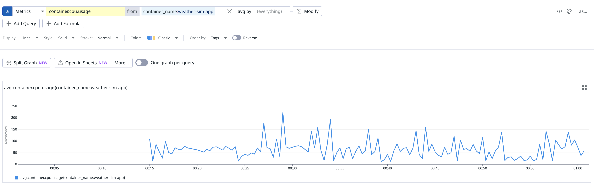
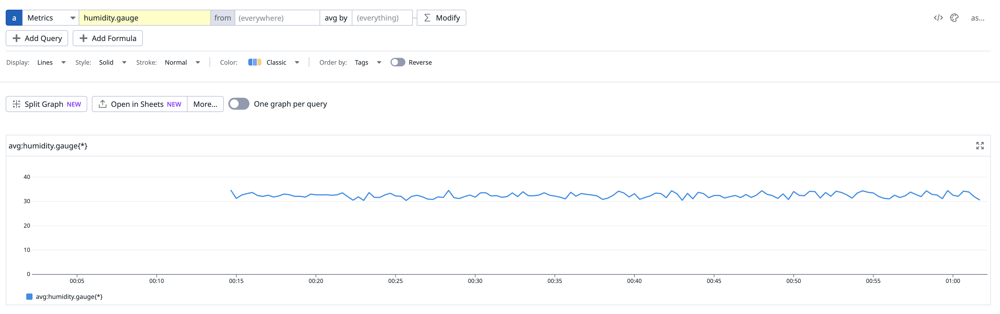

# Agent Workshop DogStatsD

## Introduction of DogStatsD
The Datadog Agent is responsible for collecting, processing, and sending various types of monitoring data to Datadog. DogStatsD works as part of the Datadog Agent by acting as an intermediary between an application and the Agent itself.

Here’s a simplified flow of how it works:

1. A customer’s application sends data to DogStatsD:
   The application (written in any supported programming language like Python, Java, etc.) sends metrics to DogStatsD by using one of the many client libraries provided by Datadog.

2. DogStatsD receives and buffers data:
   DogStatsD, running inside the Datadog Agent, collects these metrics and buffers them temporarily. It can handle various metric types like counters, gauges, histograms, and timers, which help measure specific aspects of an application, such as requests per second or memory usage.

3. The Datadog agent processes and sends data to Datadog:
   Once DogStatsD has received the metrics, it sends them to the Datadog Agent. The Agent processes the data, including applying any necessary tags, and forwards the metrics to Datadog’s backend where they are analyzed and visualized in the UI.

## 概述

這些資源用於動手故障排除：[TARDIS Telemetry: Weather Metrics in Datadog with DogStatsD](https://datadoghq.atlassian.net/wiki/spaces/TS/pages/4084793345/TARDIS+Telemetry+Weather+Metrics+in+Datadog+with+DogStatsD)

## 原始資源

- 原始 [repository](https://github.com/Dog-Gone-Earl/Agent-Spec-Sandboxes/tree/main/Dogstatsd/dogstatsd-weather-sim-app)
- 原始 [文件](https://datadoghq.atlassian.net/wiki/spaces/TS/pages/2789376418/Dogstatsd+Exercise+Python)

## 環境設定

### 步驟 1: 設定環境變數
複製 `.env.example` 為 `.env` 並填入您的 Datadog API key：

```bash
cp .env.example .env
```

編輯 `.env` 檔案：
```
DD_API_KEY=your_datadog_api_key_here
DD_SITE=datadoghq.com
```

## 如何啟動

直接執行 `setup.sh` 即可：

```bash
./setup.sh
```

### 詳細說明

#### 步驟 1: 構建應用程式映像
```bash
docker build -t weather-sim:1.0 .
```

**說明：**
- 根據當前目錄的所有檔案建立 weather-sim:1.0 映像
- 包含：weather_code.py、requirements.txt、Dockerfile 等
- 建立本地映像 weather-sim:1.0

#### 步驟 2: 啟動服務
```bash
docker compose up -d
```

**說明：**
啟動兩個容器：
- weather-sim-app (使用 weather-sim:1.0)
- datadog-agent (使用 gcr.io/datadoghq/agent:latest)

## 數據收集方式比較

| 特性 | DogStatsD (8125端口) | Docker API (自動收集) |
|------|---------------------|----------------------|
| **用途** | 應用程式發送自定義指標 | 自動收集系統資源指標 |
| **協議** | UDP | Unix socket |
| **端口** | 8125 | 無（直接訪問 Docker socket） |
| **數據流向** | weather-sim-app → datadog-agent:8125 → Datadog | Datadog Agent → Docker API → Datadog |
| **指標類型** | 自定義業務指標 | 系統資源指標 |
| **範例指標** | `temperature.gauge`, `humidity.gauge` | `container.cpu.usage`, `container.memory.usage` |
| **配置需求** | 需要 `DD_DOGSTATSD_NON_LOCAL_TRAFFIC=true` | 需要掛載 `/var/run/docker.sock` |
| **主動性** | 應用程式主動發送 | Datadog Agent 主動收集 |
| **頻率** | 由應用程式控制（目前10秒） | 由 Datadog Agent 控制（預設15秒） |
| **標籤** | 自定義標籤（如 `environment:dev`） | 自動標籤（如 `container_name:weather-sim-app`） |

## 指標查詢範例

### 1. Container Metric（container.cpu.usage）



---

### 2. Custom Metric（humidity.gauge）


